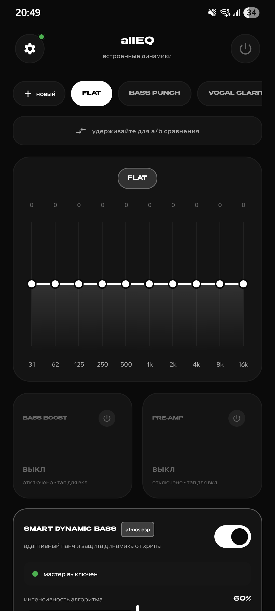
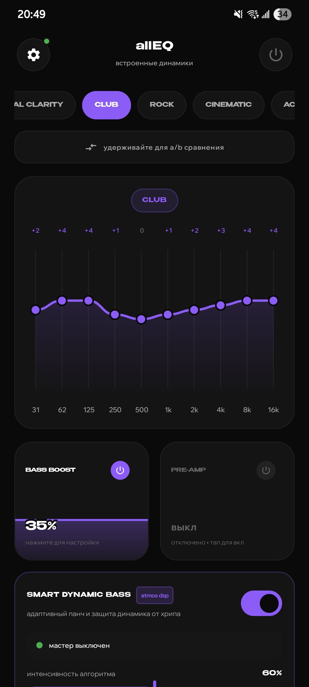
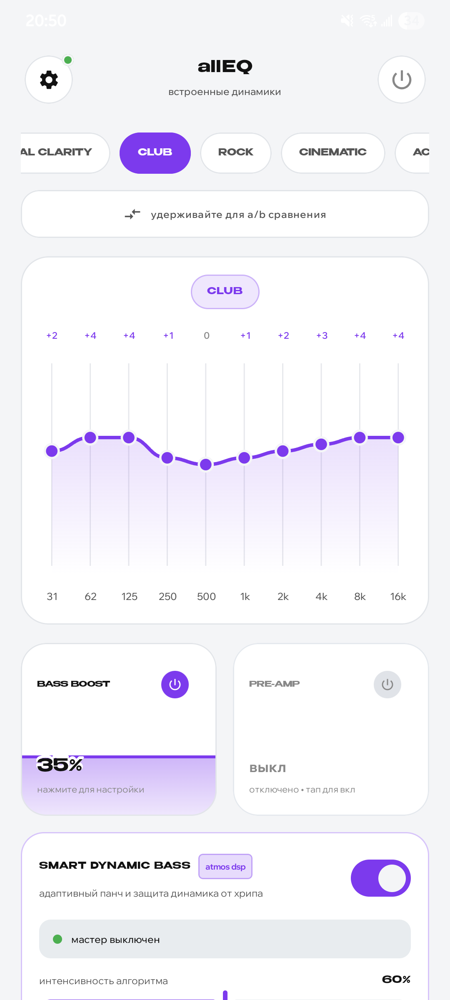
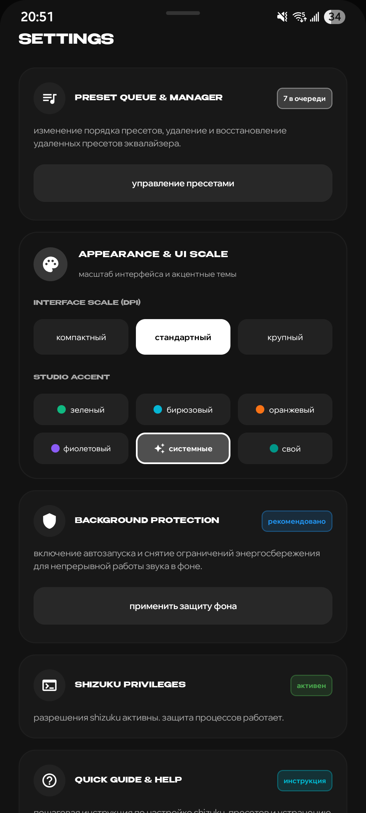

<div align="center">


# allEQ

**Rootless 10-band system equalizer for Android with Smart Dynamic Bass and tactile mixing controls.**

[](https://github.com/omixin/allEQ/releases)
[-blue.svg?style=flat-square)](https://developer.android.com)
[](https://shizuku.rikka.app)
[]()
[](LICENSE)

[**English**](README.md) • [**Русский**](README_RU.md)

</div>

---

## What It Is

**allEQ** is an open-source, rootless system-wide audio equalizer for Android built with modern Jetpack Compose and powered by [Shizuku](https://shizuku.rikka.app).

It attaches directly to the Android Audio HAL (`Session 0`) to provide low-latency, system-wide acoustic correction for built-in speakers, wired headphones, Bluetooth headsets, and external USB DACs.

* **Package name:** `com.omix.alleq`
* **Maintainer:** [@omixin](https://github.com/omixin)
* **Architecture:** 100% Kotlin, Jetpack Compose, Material 3, Android DynamicsProcessing & AudioEffects API

---

## Why This Exists

Most existing equalizer applications on Android face one of three fundamental problems:

1. **Root requirement:** Advanced DSP tools (such as ViPER4Android) require Magisk/KernelSU root, tripping SafetyNet/Play Integrity and making banking apps inaccessible.
2. **Aggressive background killing:** Non-root equalizers often rely on `NotificationListenerService` or accessibility hacks. Aggressive OEM task killers (MIUI, HyperOS, OneUI, OriginOS) terminate them within minutes of audio playback.
3. **Muffled vocals during bass boost:** Traditional equalizers simply boost lower frequencies, causing the phone's hardware amplifier protection to squash master volume and muffling speech and dialogue in videos.
4. **Bloat and trackers:** Commercial equalizers frequently package invasive analytics, full-screen advertisements, and subscription paywalls.

**allEQ was built to solve these problems directly:**

* **Rootless Session 0 Hook:** Hooks directly into `AudioEffect(AUDIO_SESSION_OUTPUT_MIX)` via Shizuku-elevated permissions (`MODIFY_AUDIO_SETTINGS`), applying EQ globally across all applications without root.
* **Smart Dynamic Bass & Vocal Protection:** Integrates an adaptive limiter (-1.5 dBFS brickwall) and dynamic mid-frequency compensation (+1.5 dB on 800–3000 Hz) so speech in podcasts, TikTok, and YouTube stays intelligible when sub-bass is boosted.
* **100% Offline & Private:** The app has zero network permissions (`android.permission.INTERNET` is not declared). Zero analytics, zero telemetry, zero trackers.
* **Zero Passive Battery Drain:** Operates via native Audio HAL effects without maintaining continuous CPU wake-locks or audio re-encoding pipelines.

---

## Screenshots

<div align="center">

| System Equalizer | Club Preset & Bass | Light Theme | Settings & Theming |
|:---:|:---:|:---:|:---:|
|  |  |  |  |
| *10-band precision faders* | *Purple accent with CLUB curve* | *Clean high-contrast daylight UI* | *Scale, colors & Shizuku status* |

</div>

---

## Key Features

### Audio DSP Engine
* **10-Band Graphic Equalizer:** Studio-calibrated frequency bands (31 Hz, 62 Hz, 125 Hz, 250 Hz, 500 Hz, 1 kHz, 2 kHz, 4 kHz, 8 kHz, 16 kHz) with smooth cubic Bézier curve visualization.
* **Tactile Capsule Faders:** Vertical swipeable faders for **Bass Boost** (0–100%) and **Pre-Amp** (-12 dB to +12 dB) with haptic feedback steps.
* **Smart Dynamic Bass:** Volume-adaptive mid-bass punch at lower volumes with high-volume cone excursion protection to eliminate speaker distortion.
* **Speech Leveller & Vocal Guard:** Baseline gain floor and mid-band lift to keep dialogue crisp across videos with varying sound masterings.
* **Instant A/B Bypass:** Hold the comparison button to temporarily bypass all DSP processing and compare directly with the uncolored sound.

### Interface & Theming
* **Expressive Studio UI:** Benzin bold headers and Wix Madefor Display body typography inspired by studio mixing consoles.
* **Color Accents:** Emerald Green, Electric Cyan, Vivid Orange, Studio Purple, System Material You, or Custom Hex Accent.
* **UI Scaling:** Three density presets (Compact 85%, Standard 100%, Large 115%) ensuring comfortable hitboxes on both compact phones and large displays.
* **Preset Manager:** Create, reorder with drag-and-drop (`☰`), delete, and restore built-in or custom presets.

### Privacy & System Integration
* **100% Offline:** No internet permissions declared in `AndroidManifest.xml`.
* **OEM Whitelist Integration:** Automated background battery-saving whitelist via Shizuku shell.

---

## Requirements

| Requirement | Specification |
|:---|:---|
| **Android Version** | Android 10.0 (API 29) or higher |
| **Root Required** | **No** (Rootless) |
| **Privilege Provider** | [Shizuku](https://shizuku.rikka.app) (Running via Wireless Debugging or ADB) |
| **Supported Devices** | Samsung, Xiaomi/Redmi, Vivo/iQOO, OnePlus, Google Pixel, Motorola, etc. |

---

## Quick Setup Guide

1. Install and start [Shizuku](https://shizuku.rikka.app) on your device (via Wireless Debugging or USB ADB from a PC).
2. Download and install `allEQ-v1.0-alpha.apk` from [Releases](https://github.com/omixin/allEQ/releases).
3. Launch allEQ and grant Shizuku permissions when prompted.
4. Tap the power button to activate system-wide equalization!

---

## Building from Source

### Prerequisites
* JDK 17
* Android SDK 35 (Platform tools & build tools)
* Gradle 8.11+ / AGP 9.2+

### Clone & Build
```bash
# Clone the repository
git clone https://github.com/omixin/allEQ.git
cd allEQ

# Build debug APK
./gradlew assembleDebug

# Build optimized release APK
./gradlew assembleRelease
```

The output signed APK will be located at:
`app/build/outputs/apk/release/app-release.apk`

---

## License

`allEQ` is distributed under the terms of the **GNU General Public License v3.0 (GPL-3.0)**.  
See the [LICENSE](LICENSE) file for the full license text.

---

<div align="center">
Developed with passion by <b><a href="https://github.com/omixin">@omixin</a></b>
</div>
